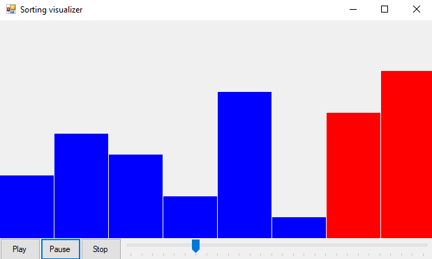

# Sorting Visualizer in VB .NET

This is a simple Bubble Sort visualizer built using VB .NET and Windows Forms. The program visualizes the steps of the Bubble Sort algorithm, allowing the user to play, pause, stop, and navigate through the sorting process using a trackbar.

## Features

- Visual representation of the Bubble Sort algorithm.
- Play, pause, and stop controls to manage the visualization.
- Trackbar to navigate through different steps of the sorting process.

## Screenshot



## Prerequisites

- Visual Studio 2012 or later.
- .NET Framework 4.5 or later.

## How to Run

1. Clone the repository:

    ```bash
    git clone https://github.com/tadrian0/sorting-visualizer-vb.git
    ```

2. Open the project file (`SortingVisualizer.vbproj`) in Visual Studio.

3. Build and run the project.

## Usage

- **Play**: Start the sorting visualization.
- **Pause**: Pause the sorting visualization.
- **Stop**: Stop the sorting visualization and reset to the initial state.
- **Trackbar**: Navigate to a specific step in the sorting process.

## Code Explanation

### Form1.vb

This file contains the main logic for the Bubble Sort visualization, including the sorting algorithm, drawing the array at each step, and handling play, pause, and stop actions.

### VisualizerComponent.vb ###

This file contains a double buffered owner drawn control that can be used to visualize each step as well as compare it with the previous step in the Bubble Sort Algorithm.

